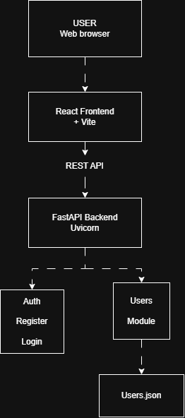

# ComicVerse AI

> An AI-powered comic platform built to combine comic discovery with intelligent features.

## Overview

ComicVerse AI is a web application designed to provide users with a centralized platform for discovering and interacting with comic and graphic-novel content.

The project is being developed with a React frontend and FastAPI backend, with authentication and user management forming the foundation of the MVP. AI-powered recommendations, smart search, chatbot assistance, and community features are planned for later development phases.

## Architecture

The current MVP follows a client-server architecture:



### Application Flow

User → React Frontend → REST API → FastAPI Backend → User Storage

## Tech Stack

| Layer | Technology |
|---|---|
| Frontend | React + Vite |
| Styling | Tailwind CSS |
| Backend | FastAPI |
| Programming Language | Python |
| API | REST |
| Authentication | Password hashing / authentication |
| Version Control | Git + GitHub |

## Current MVP Features

### Authentication
- User registration
- User login
- Password hashing
- Authentication API

### Frontend
- React-based application
- Navigation
- Home page
- Login page
- Registration page
- API integration with backend

### Backend
- FastAPI application
- REST API endpoints
- User registration endpoint
- User login endpoint
- User management functionality

## Planned Features

- Comic upload
- Comic reader
- AI-powered comic recommendations
- Smart comic search
- AI chatbot assistance
- Character information and analysis
- Community features
- Personalized recommendations

## Project Structure

```text
comicverse-ai/
│
├── assets/
│
├── backend/
│
├── frontend/
│
├── docs/
│   └── diagrams/
│       ├── architecture.drawio
│       ├── architecture.png
│       ├── er-diagram.drawio
│       ├── er-diagram(1).png
│       ├── class-module-diagram.drawio
│       └── class-module-diagram.png
│
├── .env.example
├── .gitignore
├── CHANGELOG.md
├── LICENSE
├── Problem_Statement.md
└── README.md